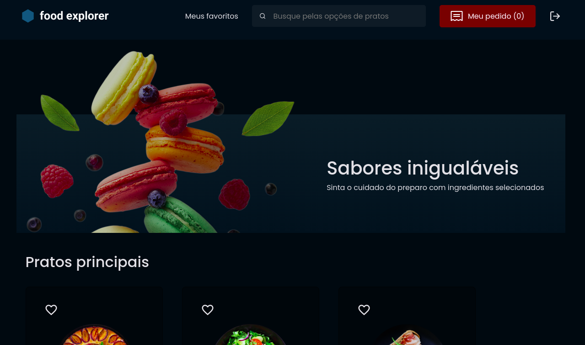

<h1 align="center">
     🥗 <a href="#" alt="site do ecoleta"> FoodExplorer </a>
</h1>

 <p align="center"> Seu Cardápio digital.. </p>

 
<h4 align="center">
	🚧   Em desenvolvimento... 🚀 🚧
</h4>


[](https://www.linkedin.com/in/jonas-martins-950a30184/)

Tabela de conteúdos
=================
<!--ts-->
   * [Sobre o projeto](#-sobre-o-projeto)
   * [Funcionalidades](#-funcionalidades)
   * [Layout](#-layout)
     * [Web](#web)
   * [Como executar o projeto](#-como-executar-o-projeto)
     * [Pré-requisitos](#pré-requisitos)
     * [Rodando o Backend (servidor)](#user-content--rodando-o-backend-servidor)
     * [Rodando a aplicação web (Frontend)](#user-content--rodando-a-aplicação-web-frontend)
   * [Tecnologias](#-tecnologias)
     * [WebSite](#user-content-website--react)
     * [Server](#user-content-server--nodejs)
   * [Contribuidores](#-contribuidores)
   * [Como contribuir no projeto](#-como-contribuir-no-projeto)
   * [Autor](#-autor)
   * [Licença](#user-content--licença)
<!--te-->

---

## 💻 Sobre o projeto

  🥗  FoodExplorer - O desafio era pra criar uma uma cardápio digital para um restaurante fictício


## Funcionalidades

- [x] Um projeto estruturado, com uma boa organização das pastas, divisão de componentes no front-end, etc;
- [x] Os dados do admin, do restaurante e dos usuários serão armazenados em um banco de dados;
- [x] Os usuários deverão se autenticar para entrar na aplicação através da tela de login, você pode aplicar o que aprendeu nas aulas de autenticação JWT;
- [x] Dê nomes significativos para as suas funções e variáveis: trabalhe um pouco com os conceitos do Clean Code;
- [x] Possibilidade de fazer uma busca pelo nome do prato, pelos ingredientes ou por prato favorito;
- [x] O admin irá fazer upload de imagens para cadastrar e editar tanto os pratos quanto os ingredientes;
- [x] Interessante deixar a aplicação responsiva: utilize o conceito de Mobile First que foi aprendido em aula;
- [x] Deixe o código mais acessível e semântico usando as dicas que foram passadas em aula;
- [x] Fica a seu critério onde aplicar animações, transições e transformações;
- [x] É essencial que a sua interface consuma a sua API;
- [x] Para finalizar, faça o deploy da sua aplicação.

---

## 🎨 Layout

O layout da aplicação está disponível no Figma:

<a href="https://www.figma.com/file/GkqG5AUJe3ppcUEHfvOX6z/food-explorer?node-id=0%3A1">
  
</a>


### Web

<p align="center" style="display: flex; align-items: flex-start; justify-content: center;">
  

  
</p>

---

## 🚀 Como executar o projeto

Este projeto é divido em duas partes:
1. Backend (pasta server) 
2. Frontend (pasta web)

💡O Frontend recisa que o Backend esteja sendo executado para funcionar.


### Pré-requisitos

Antes de começar, você vai precisar ter instalado em sua máquina as seguintes ferramentas:
[Git](https://git-scm.com), [Node.js](https://nodejs.org/en/). 
Além disto é bom ter um editor para trabalhar com o código como [VSCode](https://code.visualstudio.com/)

### 🎲 Rodando o Back End (servidor)

```bash
# Clone este repositório
$ git clone <https://github.com/jonasmartinsdev/foodexplorer-backend.git>

# Acesse a pasta do projeto no terminal/cmd
$ cd api

# Instale as dependências
$ yarn

# Execute as migration e seed
$ yarn migrate
$ yarn seed

# Execute a aplicação em modo de desenvolvimento
$ yarn dev

# O servidor inciará na porta:3333 - acesse <http://localhost:3333>
```


### 🎲 Rodando o Front End

```bash
# Clone este repositório
$ git clone <https://github.com/jonasmartinsdev/foodexplorer-frontend-.gitt>

# Acesse a pasta do projeto no terminal/cmd
$ cd fe

# Instale as dependências
$ yarn

# Execute a aplicação em modo de desenvolvimento
$ yarn dev

```

---

## 🛠 Tecnologias

Esse projeto foi desenvolvido com as seguintes tecnologias:

- HTML
- CSS
- JavaScript
- Node.js
- React.js

---

## 📝 Licença

Este projeto esta sobe a licença [MIT](./LICENSE).

Feito com ❤️ por Jonas Martins 👋🏽 [Entre em contato!](https://www.linkedin.com/in/jonas-martins-950a30184)

---


<!-- ##  Versões do README

[Português 🇧🇷](./README.md)  |  [Inglês🇺🇸](./README-en.md) -->